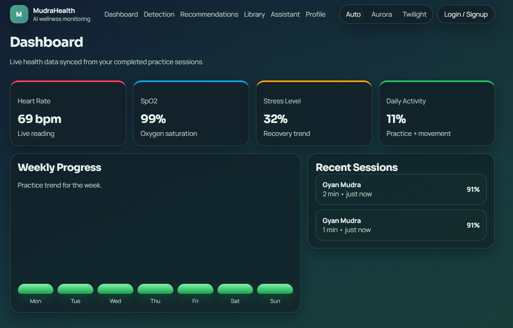
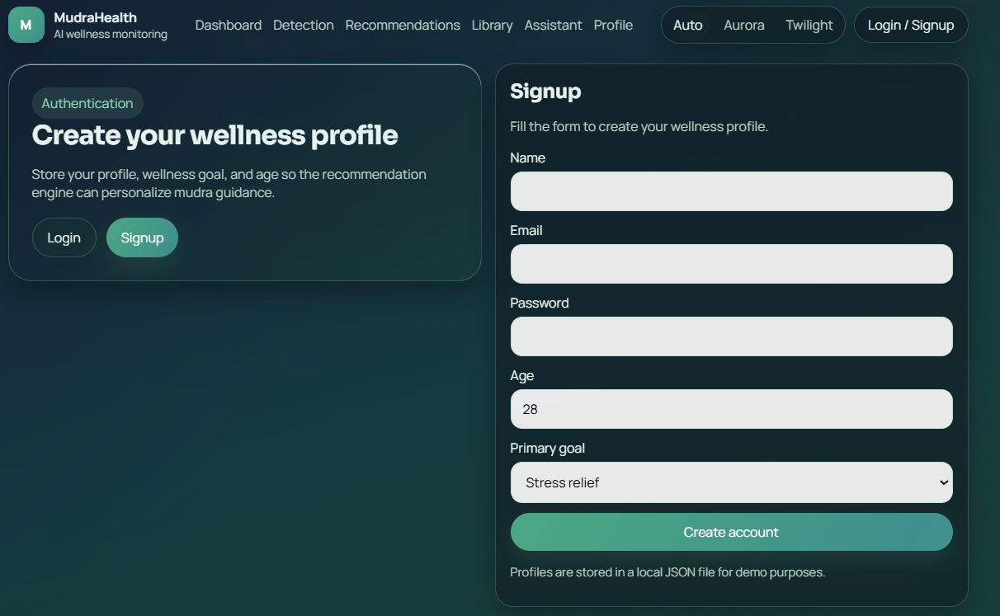
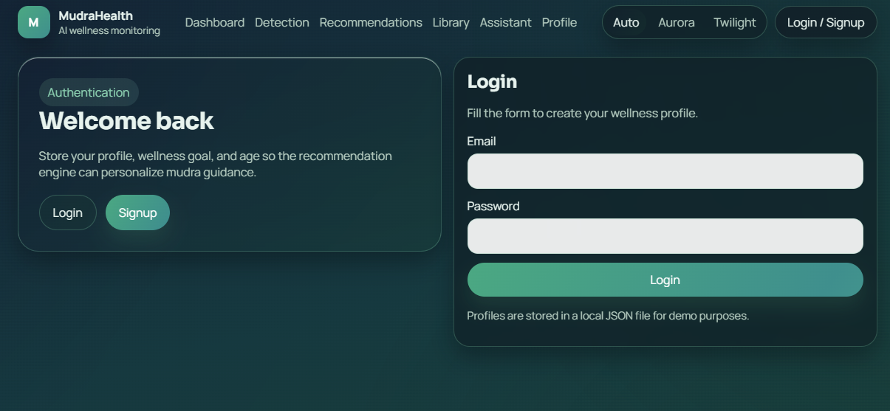
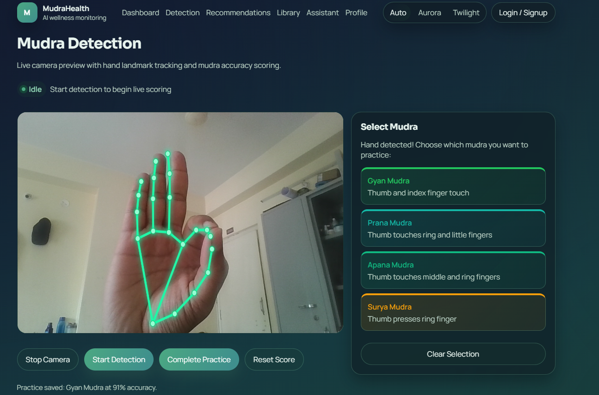
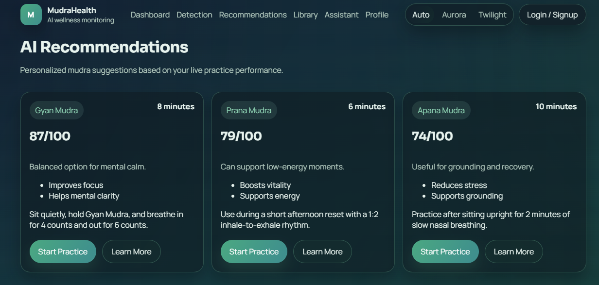
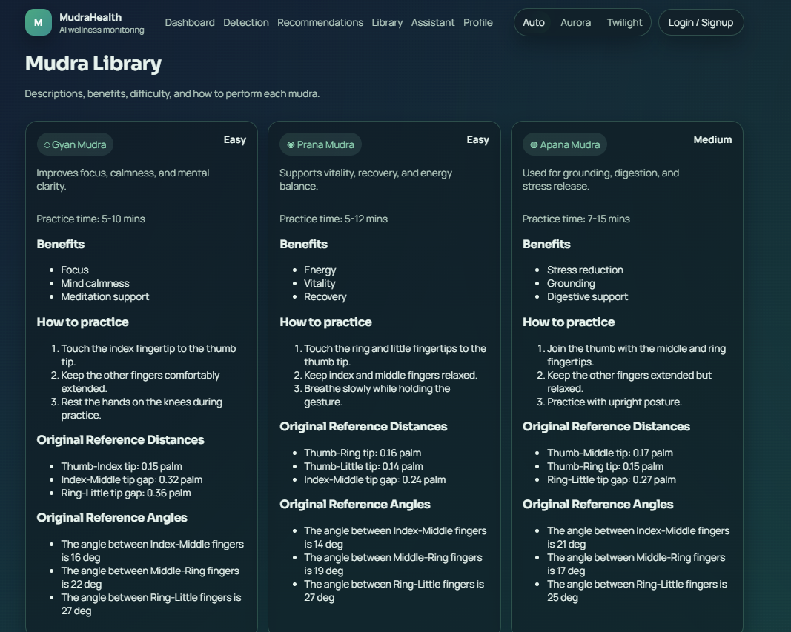
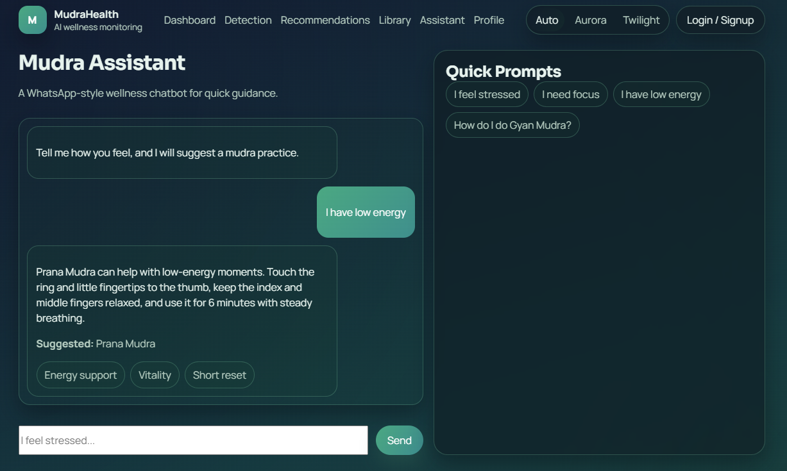
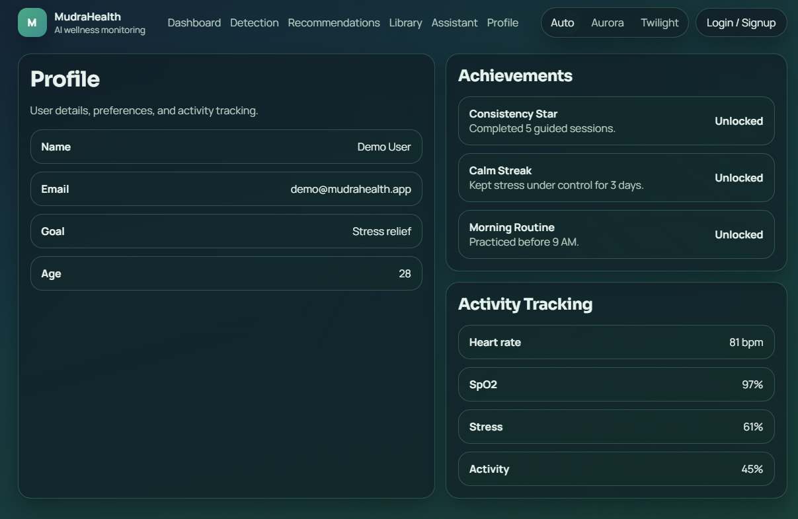
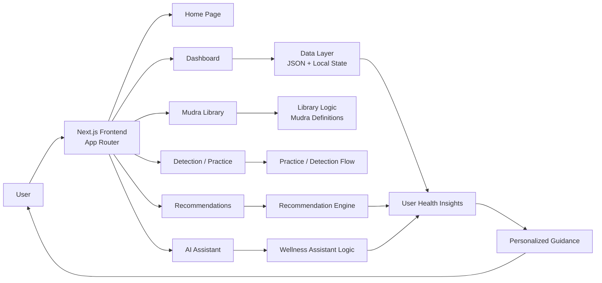

# Smart Mudra Wellness System for Personalized Health Monitoring

<p align="center">
  
</p>

Smart Mudra Wellness System is a full-stack wellness and wellness-tracking web application designed to combine the wisdom of traditional hand mudras with personalized health insights, guided practice, and AI-style recommendations. The system provides an interactive dashboard, mudra library, wellness assistant, recommendation engine, and health-monitoring views in one platform.

## Project Overview

This project is built as a modern digital wellness companion for users who want to:

- practice mudra techniques in a structured way
- track wellness metrics such as stress, heart rate, oxygen level, and activity
- receive guided recommendations based on their health profile and goals
- access a simple AI-powered assistant for quick guidance
- learn the purpose and technique of different mudras through an educational interface

The app is designed as a prototype and demonstration platform for health monitoring, digital wellness coaching, and hands-on practice support.

## Why This Project Matters

The platform combines traditional wellness practices with digital personalization. It helps users move beyond static guidance by giving them:

- a visual dashboard of health metrics
- a personalized routine recommendation system
- a mudra practice library with explanations and benefits
- an interactive assistant for mood and wellness guidance
- a learning-friendly interface for beginners and daily wellness routines

This makes the project useful for education, wellness tracking, and future extension into real health integrations or wearable-based monitoring.

## Key Features

### 1. Personalized Health Dashboard
- Simulated health indicators such as heart rate, SpO2, stress, and activity
- Weekly progress visualization
- Practice session summaries and recent activity tracking

### 2. Mudra Library
- A collection of mudras such as Gyan, Prana, Apana, Surya, and Vayu
- Descriptions, benefits, duration, difficulty, and step-by-step guidance
- Structured learning for beginners and daily practice users

### 3. Detection and Practice Flow
- Mudra detection and scoring interface
- Practice session support for wellness routines
- Focus on user feedback, alignment guidance, and improvement tracking

### 4. AI Wellness Assistant
- Chat-like experience for quick guidance
- User input such as stress, tiredness, low energy, or focus issues
- Suggested mudras and supportive wellness advice

### 5. Personalized Recommendations
- Recommendations generated based on simulated wellness inputs and user goals
- Routine suggestions with benefits and timing
- Helps connect health patterns to wellness actions

### 6. User Profile and Authentication
- Sign-in and sign-up interface
- Profile-oriented experience for a future personalized health application

## Tech Stack

- Next.js
- React
- TypeScript
- CSS Modules / custom CSS
- JSON-based sample data and local state management

## Project Structure

```text
Smart-Mudra-Wellness-System-for-Personalized-Health-Monitoring-
├── app/
│   ├── api/
│   ├── assistant/
│   ├── auth/
│   ├── dashboard/
│   ├── detection/
│   ├── library/
│   ├── profile/
│   ├── recommendations/
│   ├── globals.css
│   ├── layout.tsx
│   └── page.tsx
├── components/
├── data/
├── lib/
├── package.json
├── next.config.mjs
├── tsconfig.json
├── README.md
├── .gitignore
├── app.js
├── index.html
├── styles.css
└── command.txt
```

## Main Application Pages

- Home page
- Authentication page
- Dashboard page
- Detection page
- Mudra library page
- Recommendations page
- AI assistant page
- Profile page

## Screenshots

The screenshots below capture the main user journeys of the Smart Mudra Wellness app, including signup, login, detection, dashboard, recommendations, library, assistant, and profile views.

### Signup Page



### Login Page



### Mudra Detection Page



### Dashboard


### Recommendations



### Mudra Library



### AI Assistant



### User Profile



## Project Architecture



This architecture keeps the interface, recommendation logic, and wellness guidance organized into distinct modules while allowing the app to be expanded with real backend services later.

## How to Run Locally

### Prerequisites

- Node.js (recommended: latest LTS)
- npm

### Install dependencies

```bash
npm install
```

### Start the development server

```bash
npm run dev
```

Then open:

```text
http://localhost:3000
```

## Production Build

```bash
npm run build
npm run start
```

## Important Notes

- This project is a wellness prototype and demo application.
- It uses simulated health metrics and sample recommendations rather than live medical device data.
- The app is not a substitute for medical advice, diagnosis, or treatment.
- The platform is designed for learning, demonstration, and future customization.

## Future Scope

This project can be expanded with:

- real sensor integrations
- authentication with database support
- wearable health data syncing
- deeper AI-based recommendations
- cloud deployment and user dashboards
- secure data storage and analytics

## Disclaimer

This project is intended for educational, wellness, and demonstration purposes only. It should not be used as a medical decision-making tool.

## License

This project is available for educational and personal use. Please check your repository settings or add a license file if you want to define formal usage terms.
